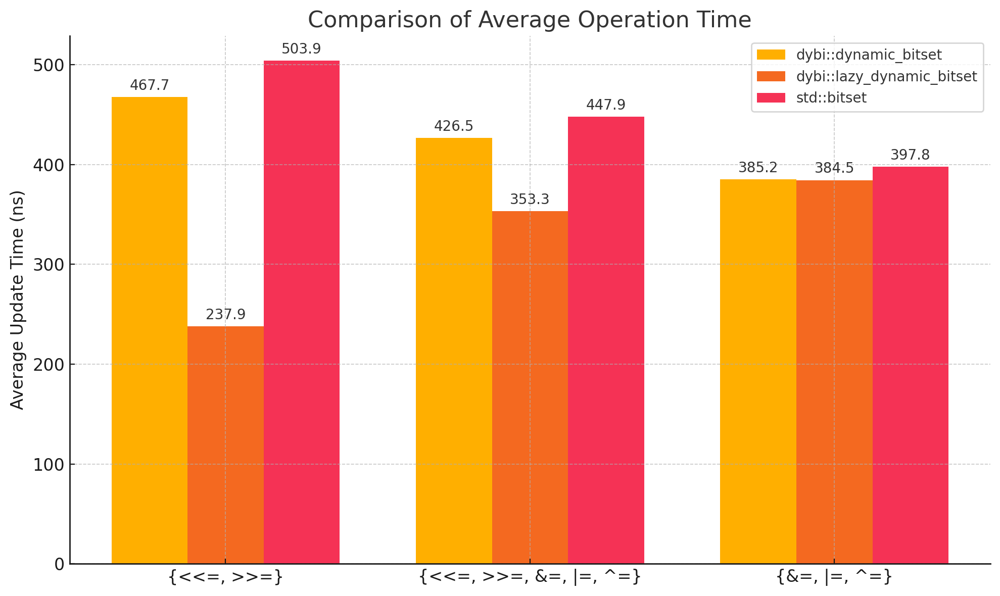

# Dynamic Bitsets!

This library provides two bitset implementations (`dybi::dynamic_bitset` and `dybi::lazy_dynamic_bitset`) that offer the following benefits over `std::bitset`:

- Dynamic size (the ability to resize and a relaxation of the constraint that forces you to declare the size of the bitset of compile time).
- More (accessible) functionality. You can perform arbitrary range queries with greater ease.
- Better performance, particularly so when utilizing the lazy variant in shift heavy workloads. There is a noticeable (albeit unremarkable) improvement in general performance when benchmarked artificially (shown below), but the difference seems to be more noticeable in real-world use (I just realized that I referred to codeforces problems as "real-world use" O_O). 

## Usage

```cpp
#include <iostream>
#include <random>
#include "dynamic_bitset.hpp"
#include "lazy_dynamic_bitset.hpp"

using dbitset = dybi::dynamic_bitset;
using dbitset_lazy = dybi::lazy_dynamic_bitset;

int main()
{
    int n;
    std::cin >> n;

    dbitset b(n);
 
    //write code like you would with std::bitset!

    b[n/2] = 1;
    b <<= 4;
    //..
    //..
    //..
}
```

Note: Enabling O3 and loop unrolling makes all operations about twice as fast, so always do so.

## Benchmarks



Some information about this admittedly poor benchmark:
- The size of the bitset was $10^5$ across all operations.
- The code used to benchmark can be found in the "test" directory.
- The compiler used was GCC 14, with the flags `-O3 -march=native -funroll-loops`.
- The device used was a M3 Mac.